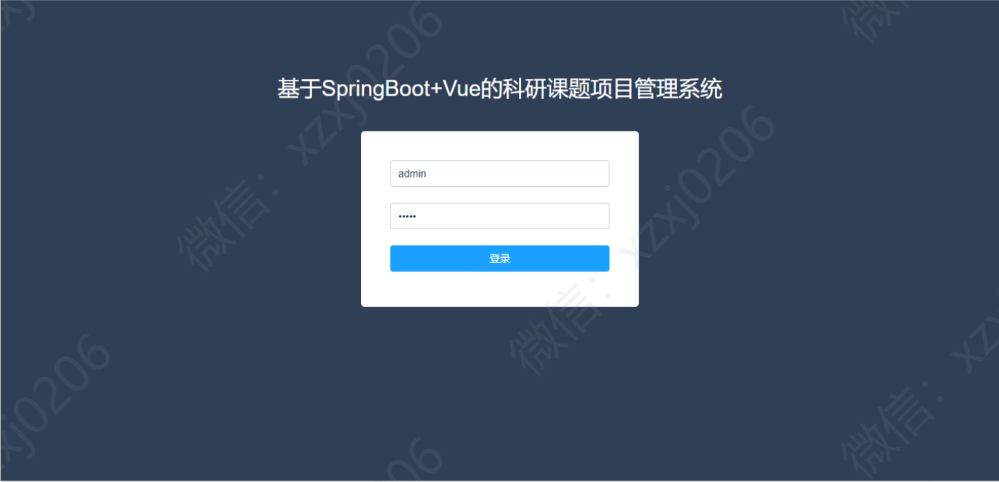
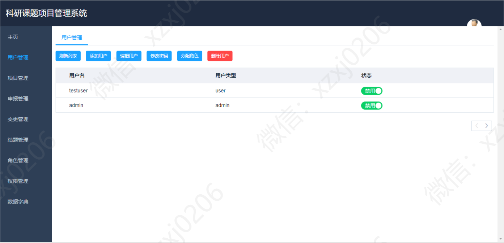
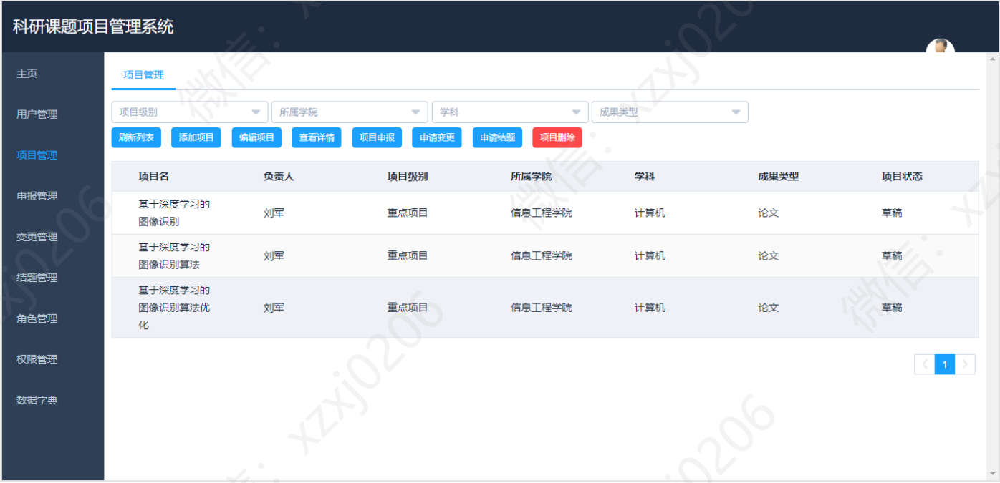
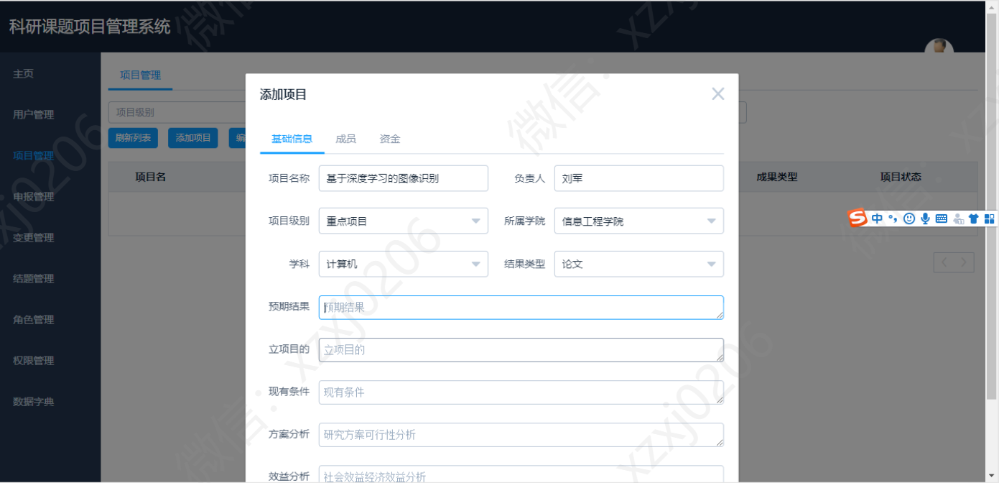
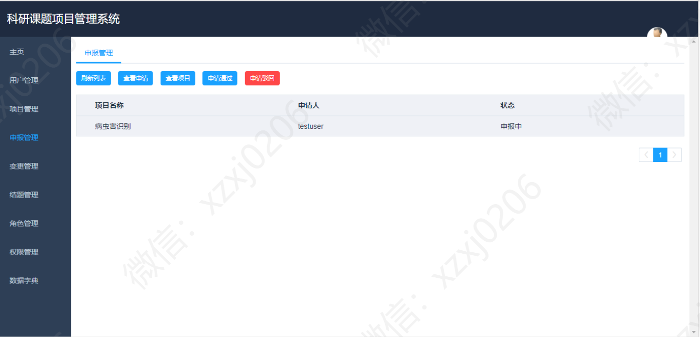
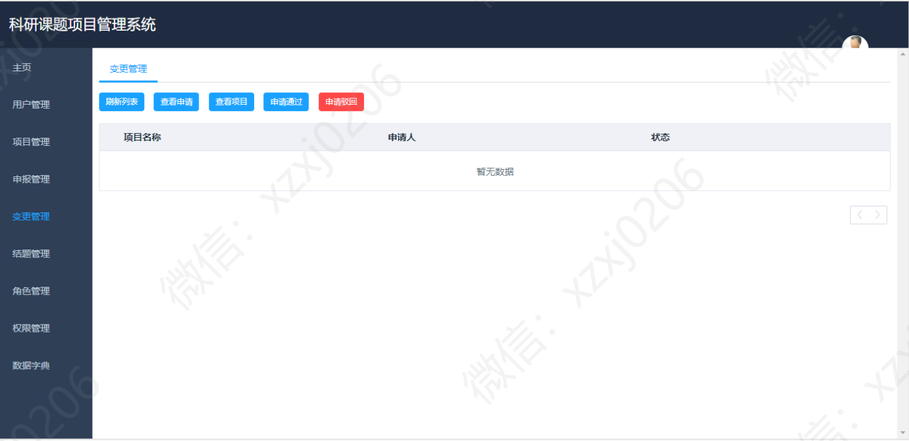
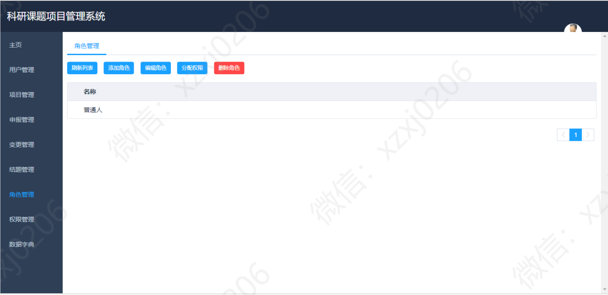
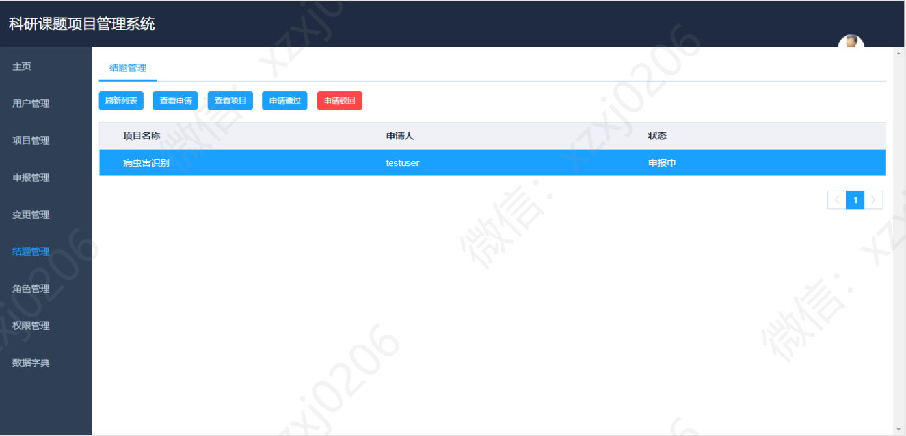
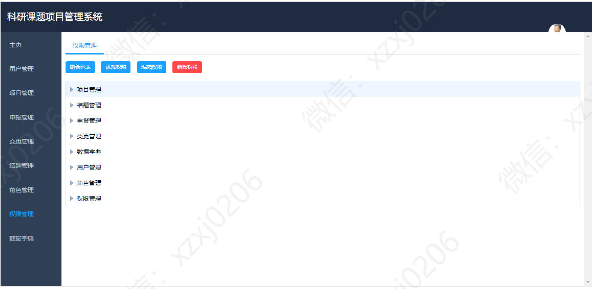
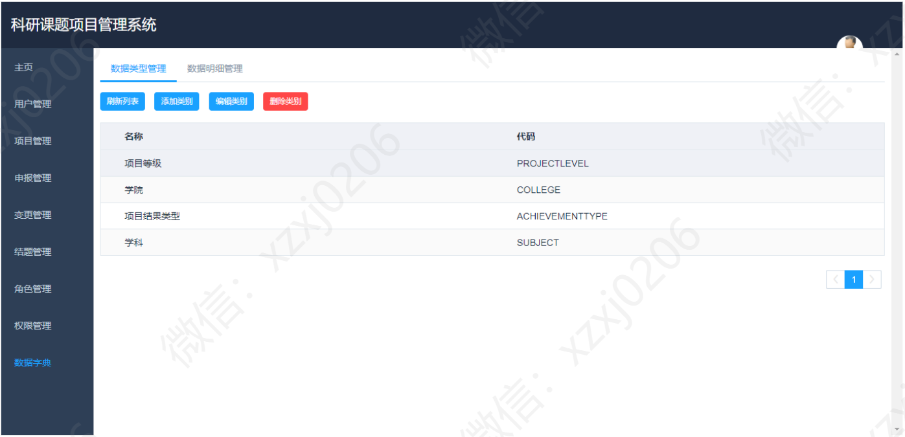

# 大学科研课题项目管理系统

## 9.9￥ 获取完整源码+sql，需要加Q：3808981644 备用Q：3577148218
## 有问题，或者需要协助调试运行项目的也可联系
### 更多项目： https://github.com/34426?tab=repositories

## 一、介绍

基于SpringBoot+Vue的前后端分离的科研课题项目管理系统

开发语言：java

运行环境:idea或eclipse vscode 数据库:mysql

实现 登录 /注销、 用户管理、项目管理、申报管理、变更管理、结题管理、角色管理、权限管理、数据字典等功能 ；

数据字典：刷新列表、添加类别、编辑类别、删除类别

权限管理：管理员功能]刷新列表、添加权限、编辑权限、删除权限

角色管理：刷新列表、添加角色、编辑角色、分配权限、删除角色

结题管理：刷新列表、查看申请、查看项目、申请通过、申请驳回

变更管理：刷新列表、查看申请、查看项目、申请通过、申请驳回

申报管理：刷新列表、查看申请、查看项目、申请通过、申请驳回

项目管理：刷新列表、添加项目、编辑项目、查看详情、项目申报、申请变更、申请结题、项目删除

## 二、系统运行界面

## 三、 9.9￥ 获取完整源码+sql，需要加Q：3808981644 备用Q：3577148218
## 有问题，或者需要协助调试运行项目的也可联系

