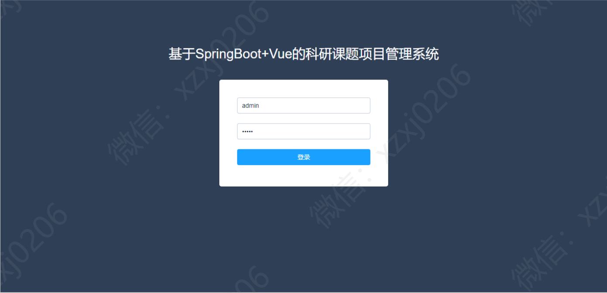
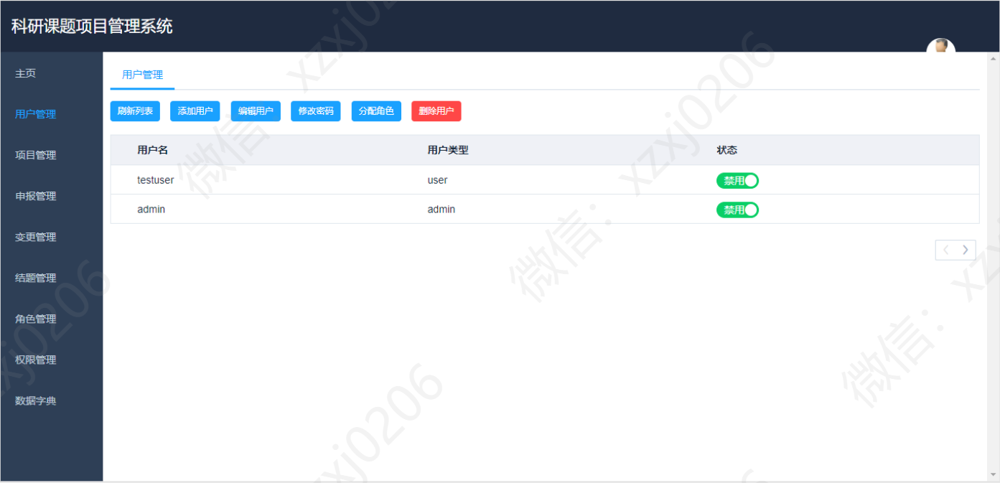
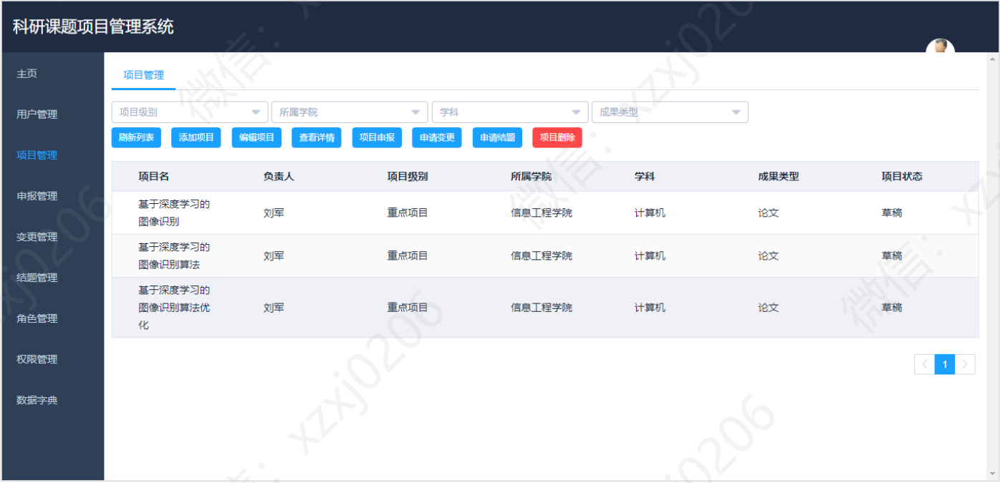
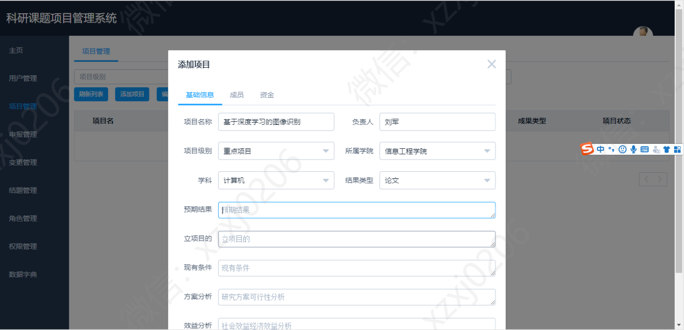
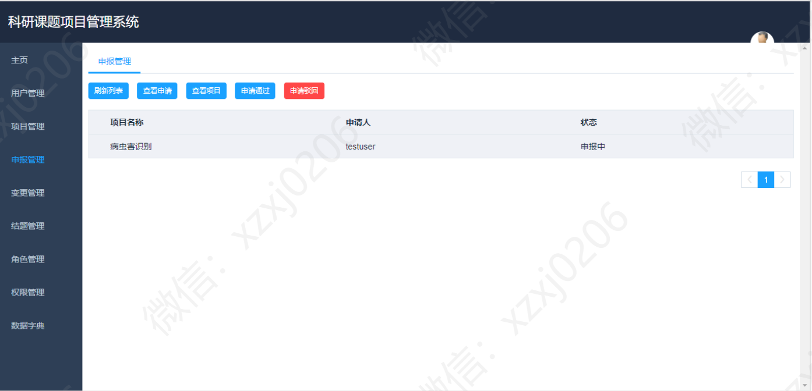
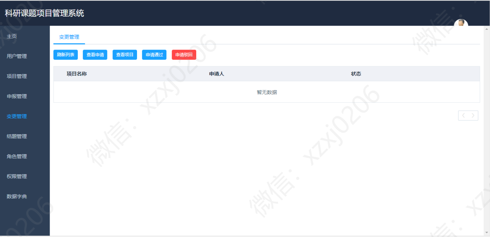
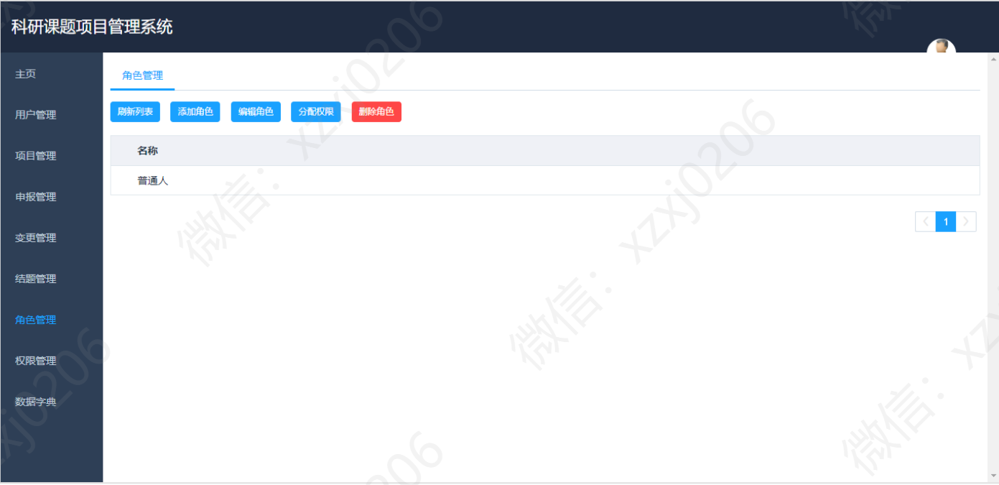
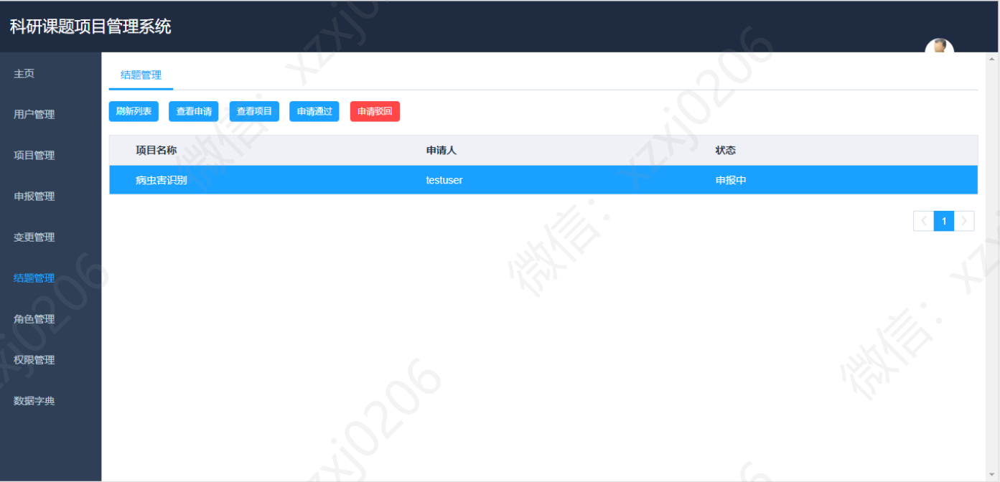
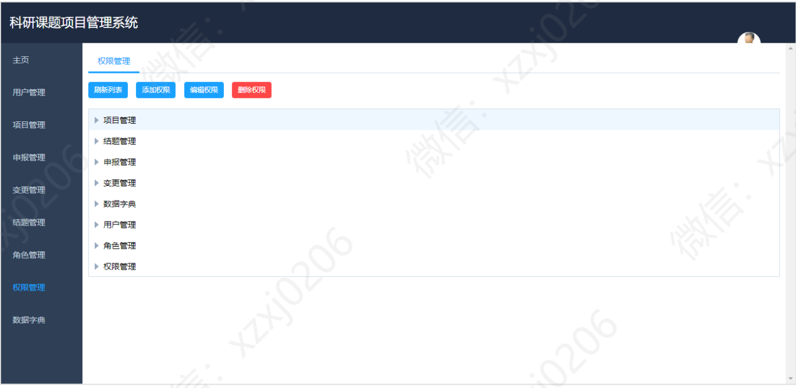
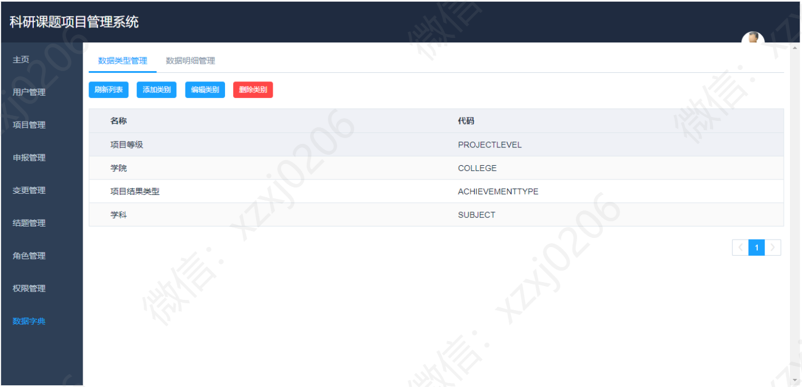

# 大学科研课题项目管理系统

### 完整项目获取

通过网盘分享的文件：科研课题项目管理系统

链接: https://pan.baidu.com/s/18RVQju0nVFo3On8WL-zwtQ?pwd=4ypm 提取码: 4ypm --来自百度网盘超级会员v3的分享

通过网盘分享的文件：工具包

链接: https://pan.baidu.com/s/1YmdoJvkjoUjA75wvHLDZ6A?pwd=xm96 提取码: xm96
--来自百度网盘超级会员v3的分享

需要远程项目部署或项目修改和毕业设计也可联系（添加申请时请备注好来意）

通过网盘分享的文件：远程调试部署联系方式

链接: https://pan.baidu.com/s/1W0dDcoZmayG0c7USJDYBYg?pwd=nqd7 提取码: nqd7
--来自百度网盘超级会员v3的分享

### 项目合集(项目不断更新中)
链接: https://pan.baidu.com/s/1nY-zhvAK0CXYcn3g7LzQnQ?pwd=id3c 提取码: id3c
--来自百度网盘超级会员v3的分享

#### 这些项目一起发你了 可以分享给你需要的同学 调试可找我 也接二次修改和项目定制、毕业设计等

## 接毕业设计和论文

微信联系方式：xzxj0206  QQ：3808981644   (支持修改、 部署调试、 支持代做毕设)

接网站建设、小程序、H5、APP、各种系统等，单片机、嵌入式也可以做

选题+开题报告+任务书+程序定制+安装调试+论文+答辩ppt  都可以做

## 一、介绍

基于SpringBoot+Vue的前后端分离的科研课题项目管理系统

开发语言：java

运行环境:idea或eclipse vscode 数据库:mysql

实现 登录 /注销、 用户管理、项目管理、申报管理、变更管理、结题管理、角色管理、权限管理、数据字典等功能 ；

数据字典：刷新列表、添加类别、编辑类别、删除类别

权限管理：管理员功能]刷新列表、添加权限、编辑权限、删除权限

角色管理：刷新列表、添加角色、编辑角色、分配权限、删除角色

结题管理：刷新列表、查看申请、查看项目、申请通过、申请驳回

变更管理：刷新列表、查看申请、查看项目、申请通过、申请驳回

申报管理：刷新列表、查看申请、查看项目、申请通过、申请驳回

项目管理：刷新列表、添加项目、编辑项目、查看详情、项目申报、申请变更、申请结题、项目删除

## 二、系统运行界面

